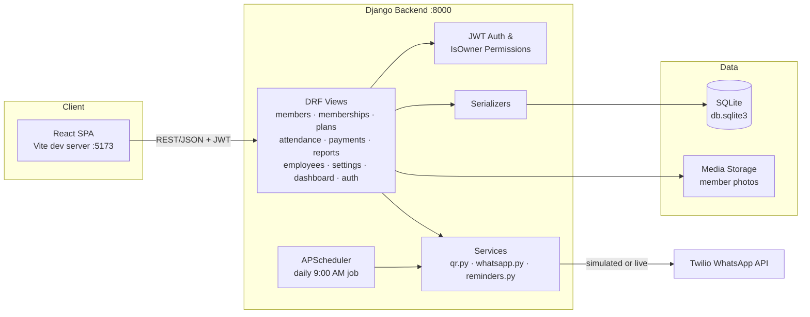
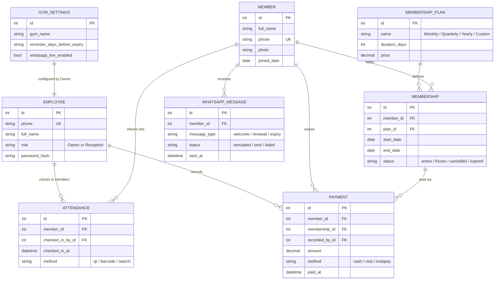

# Appex Gym

Full-stack gym management system — members, memberships, attendance, payments, and reports, all from one dashboard.


## Why

Most small gyms run on spreadsheets and paper sign-in sheets — no history, no automation, no real numbers on renewals or revenue. Appex Gym replaces that with a single web app: role-based logins for owners and reception staff, QR-code check-ins, automated WhatsApp reminders for renewals and expirations, and exportable reports so you can actually see how the business is doing.

## Demo


## Table of Contents

- [Requirements](#requirements)
- [Features](#features)
- [Architecture Diagram](#architecture-diagram)
- [API Documentation](#api-documentation)
- [Database Design](#database-design)
- [Quick Start](#quick-start)
  - [1. Backend](#1-backend)
  - [2. Frontend](#2-frontend)
- [WhatsApp Integration](#whatsapp-integration)
- [Django Admin](#django-admin)
- [Project Structure](#project-structure)
- [Contributing](#contributing)
- [License](#license)

## Requirements

- Python 3.10+
- Node.js 18+ (frontend only)

## Features

**Authentication & Authorization**
- JWT authentication
- Role-based access (Owner / Reception)
- Secure, protected API endpoints

**Dashboard**
- Total & active members, expired memberships
- Monthly revenue, today's renewals, daily check-ins
- Revenue & attendance charts

**Members**
- Add and manage members, full profile history
- Photo upload, search by name or phone

**Memberships & Plans**
- Create, renew, freeze, or cancel memberships
- Monthly / quarterly / yearly plans with custom pricing and duration
- Full membership history

**Attendance**
- QR code check-in (optional barcode support)
- Search check-in

**Payments**
- Cash, Visa, and Instapay
- Full payment history

**Reports**
- Revenue, attendance, membership, and member reports
- Export to Excel or PDF

**Employees**
- Employee management with Owner / Reception permission levels

**Smart Automation**
- Automatic QR generation
- WhatsApp welcome messages
- Renewal and expiration reminders

**Settings**
- Gym info, membership settings, reminder configuration, WhatsApp integration

## Architecture Diagram

Standard three-tier setup: a React SPA talks to a Django REST API over JSON, the API sits in front of SQLite, and a background scheduler drives the WhatsApp reminder flow through Twilio.



**Flow notes**

- The frontend never talks to Twilio or the database directly — everything goes through the DRF API, authenticated with a JWT issued at login.
- `IsOwner` gates Owner-only endpoints (e.g. employee management, settings); Reception accounts get a reduced view of the same API.
- APScheduler starts inside the same process as `manage.py runserver` and fires `reminders.py` once a day; the same logic is reachable on demand via `python manage.py run_reminders`.
- `whatsapp.py` is Twilio-shaped but defaults to a `simulated` mode — every send is logged to `WhatsAppMessage` regardless of whether real credentials are configured.

## API Documentation

All endpoints are prefixed with `/api/` and (aside from login) require a JWT in the `Authorization: Bearer <token>` header. Routes are grouped by module under `gym/views/`, one file per resource.

| Module | Base path | Access | Description |
|---|---|---|---|
| Auth | `/api/auth/` | Public | Phone + password login, JWT issue/refresh |
| Dashboard | `/api/dashboard/` | Owner, Reception | Totals, revenue, today's renewals, check-ins, chart data |
| Members | `/api/members/` | Owner, Reception | CRUD, photo upload, search by name/phone |
| Memberships | `/api/memberships/` | Owner, Reception | Create, renew, freeze, cancel, history |
| Membership Plans | `/api/plans/` | Owner | CRUD on Monthly/Quarterly/Yearly (+ custom) plans |
| Attendance | `/api/attendance/` | Owner, Reception | QR/barcode check-in, check-in search |
| Payments | `/api/payments/` | Owner, Reception | Record payments (Cash/Visa/Instapay), payment history |
| Reports | `/api/reports/` | Owner | Revenue, attendance, membership, member reports; Excel/PDF export |
| Employees | `/api/employees/` | Owner | Employee CRUD, role assignment |
| Settings | `/api/settings/` | Owner | Gym info, reminder config, WhatsApp toggle |
| WhatsApp | `/api/whatsapp/` | Owner | Message log, manual reminder trigger |

Each module follows standard DRF `ModelViewSet` conventions:

```
GET    /api/<module>/          list
POST   /api/<module>/          create
GET    /api/<module>/<id>/     retrieve
PUT    /api/<module>/<id>/     update
PATCH  /api/<module>/<id>/     partial update
DELETE /api/<module>/<id>/     delete
```

Request/response shapes are defined in `gym/serializers.py`. Since there's no OpenAPI/Swagger schema wired up yet, the most reliable reference is that file plus the corresponding view in `gym/views/`, or the Django admin at `/admin/` for a quick look at live data.

## Database Design

Core entities and how they relate. Field lists below are representative of each model's purpose — check `gym/models.py` for the authoritative field set.



**Notes**

- `Member` is the hub entity — attendance, payments, memberships, and WhatsApp messages all key off it.
- `Employee` uses phone as the login identifier (not a username) and drives `IsOwner`-gated permissions across the API.
- `Membership` links a `Member` to a `MembershipPlan` and carries its own lifecycle state (`active` / `frozen` / `cancelled` / `expired`) independent of the plan itself, so freezing or cancelling one membership doesn't touch the plan definition.
- The database is SQLite by default (`backend/db.sqlite3`), which is fine for a single-gym deployment but worth swapping for Postgres/MySQL if you outgrow single-writer SQLite.

## Quick Start

### 1. Backend

```bash
cd backend
python3 -m venv venv
source venv/bin/activate        # Windows: venv\Scripts\activate
pip install -r requirements.txt
cp .env.example .env
python manage.py migrate
python manage.py seed_gym       # creates default logins + sample plans
python manage.py runserver 0.0.0.0:8000
```

The API runs at `http://localhost:8000`. `seed_gym` creates:

| Role      | Phone          | Password       |
|-----------|----------------|----------------|
| Owner     | `01000000000`  | `owner123`     |
| Reception | `01000000001`  | `reception123` |

It also seeds three sample plans (Monthly / Quarterly / Yearly). The SQLite database is created automatically at `backend/db.sqlite3`; uploaded member photos are stored under `backend/media/`.

### 2. Frontend

In a separate terminal:

```bash
cd frontend
npm install
npm run dev
```

Open `http://localhost:5173` and log in with one of the seeded accounts above. `frontend/.env` points the app at `http://localhost:8000/api` — change `VITE_API_URL` there if you're running the backend elsewhere.

## WhatsApp Integration

Notifications (welcome messages, renewal reminders, expiry reminders) use a Twilio-shaped integration in `gym/services/whatsapp.py`. Out of the box every trigger is logged to the database with status `simulated` — no real messages are sent. To go live:

1. Create a [Twilio](https://www.twilio.com/whatsapp) account and set up a WhatsApp sender.
2. Add credentials to `backend/.env`:

   ```
   TWILIO_ACCOUNT_SID=...
   TWILIO_AUTH_TOKEN=...
   TWILIO_WHATSAPP_FROM=+1415XXXXXXX
   ```

3. In the app, go to **Settings → WhatsApp Integration** and enable live sending.

The reminder job runs automatically every day at 9:00 AM via APScheduler (started when `manage.py runserver` boots). Trigger it manually anytime with:

```bash
python manage.py run_reminders
```

This is also exposed as a button in the app under **WhatsApp Log**.

## Django Admin

A full admin panel is available at `http://localhost:8000/admin/` for direct database inspection and editing.

```bash
python manage.py createsuperuser
```

You'll be asked for phone, full name, and password — the custom user model logs in by phone, not username.

## Project Structure

```
backend/
  config/                    Django project settings, URLs
  gym/
    models.py                Employee, GymSettings, MembershipPlan, Member,
                              Membership, Payment, Attendance, WhatsAppMessage
    serializers.py            DRF serializers
    permissions.py            IsOwner permission class
    urls.py                   All /api/ routes
    views/                    One file per module — members, memberships, plans,
                              attendance, payments, reports, employees, settings_view,
                              dashboard, whatsapp, auth
    services/
      qr.py                   QR generation
      whatsapp.py             Twilio-shaped WhatsApp sender (simulated by default)
      reminders.py            Reminder-check logic (APScheduler + management command)
    management/commands/
      seed_gym.py             Default logins + sample plans
      run_reminders.py        Manual reminder trigger
frontend/                    React app, talks to the API via VITE_API_URL
```

## Contributing

Issues and pull requests are welcome. If you're planning a larger change, open an issue first to discuss the approach before submitting a PR.

## License

No license has been specified for this repository yet. Until one is added, all rights are reserved by the author — check with [maZen04](https://github.com/maZen04) before reusing this code.
